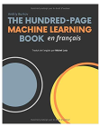
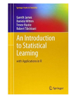
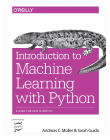

<div style="text-align: center">
    
</div>

# Formation en apprentissage machine au CRIUSMM

Ce "répo" github contient le matériel utilisé dans la formation en apprentissage machine donnée au CRIUSMM à l'automne 2019.

Le matériel est disponible dans des dossiers séparés pour les 5 sessions théoriques et de démonstration (```intro/cours_1, cours_2, cours_3, cours_4 et cours_5```) et les 2 séances de travaux pratiques (```TP_1 et TP_2```). 

Chaque cours repose sur un notebook *Jupyter* (https://jupyter.org), une application WEB qui permet de créer et de partager des documents contenant du code et d'en visualiser le résultat. Toutes les démonstrations reposent sur *ScikitLearn* (https://scikit-learn.org/), une bibliothèque libre *Python* dédiée à l'apprentissage machine. 

Les données utilisées pour tous les exemples proviennent de données simulées (fichier ```/data/sim_data_signature.csv``` contenant des données transversales pour 543 patients et 90 contrôles, avec 222 variables) à partir de la banque de données Signature (https://www.banquesignature.ca). *__Il est strictement interdit d'utiliser ces données à d'autres fins que de formation. Toute demande d'accès doit être formulée en bonne et due forme:__* https://www.banquesignature.ca/demande-acces/faire-une-demande-dacces/

Afin de ne pas requérir des participants à la formation de créer un environnement leur permettant l'exécution fluide des notebooks (anaconda recommandé: https://www.anaconda.com/distribution/), une version interactive est accessible sur *Binder* (https://mybinder.org): [](https://mybinder.org/v2/gh/pnplab/ML_CRIUSMM/master)


## Plan de formation

### Intro: mise en bouche
- Considérations pratiques: python, scikitlearn, github, binder
- Les termes: Intelligence artificielle, apprentissage machine, apprentissage profond, big data
- L'apprentissage machine en psychiatrie
- Survol

### Cours 1: Les concepts
- Statistiques classiques vs apprentissage machine
    - déduction vs induction
    - postulats
    - biais et variance
    - généralisation: groupe vs individu
    - N et P
    - complexité des modèles
    - interprétation vs prédiction
- Apprentissage machine supervisé vs non supervisé
    - supervisé: régression vs classification
    - métriques de performance
    - non supervisé

### Cours 2: Apprentissage machine - Modèles linéaires
- Fonction de coût
- (Cross)validation
- Régularisation
- Régression (simple et logistique), analyse discriminante linéaire, analyse en composantes indépendantes

### Cours 3: Apprentissage machine supervisé: modèles non linéaires
- (...)

### Cours 4: Apprentissage machine non supervisé
- (...)

### Cours 5: Réseaux de neurones (profonds) et perspectives
- (...)

## Ressources additionnelles

### Livres

- *The hundred pages machine learning book* (Burkov, 2019): http://themlbook.com. Version gratuite en ligne, et traduction française disponible sur amazon.

<div>
    
</div><br/>


- *An introduction to statistical learning with applications in R* (James, Witten, Hastie & Tibshirani, 2014): http://faculty.marshall.usc.edu/gareth-james/ISL/. Version gratuite en ligne.

<div>
    
</div><br/>


- *Introduction to machine learning with Python* (Muller & Guido, 2016).

<div>
    
</div><br/>

### Articles

- 

